<h1 align="center">Rafael Benevides</h1>

  <strong>Principal Software Engineer @ Red Hat</strong> 
  Cloud Native | Java | Go | Kubernetes | DevOps

  <a href="https://rafabene.com">rafabene.com</a>

---

### About me

Brazilian software engineer with 20+ years of experience building enterprise and cloud-native applications. I help developers apply the best strategies in the industry to produce high-scalable software using Java, Go, Kubernetes, and modern DevOps practices.

---

### Tech stack

  
  
  
  
  

---

### Books & publications

| Title | Publisher |
|-------|-----------|
| [Microservices for Java Developers, 2nd Edition](https://developers.redhat.com/e-books/microservices-java-developers-hands-introduction-frameworks-and-containers) | O'Reilly |
| [97 Things Every Java Programmer Should Know](https://www.oreilly.com/library/view/97-things-every/9781491952689/) | O'Reilly |

---

### Talks

Full list at [rafabene.com/talks](https://rafabene.com/talks/)

---

### GitHub stats

  
  

---

### Connect with me

  
  
  
  
  

